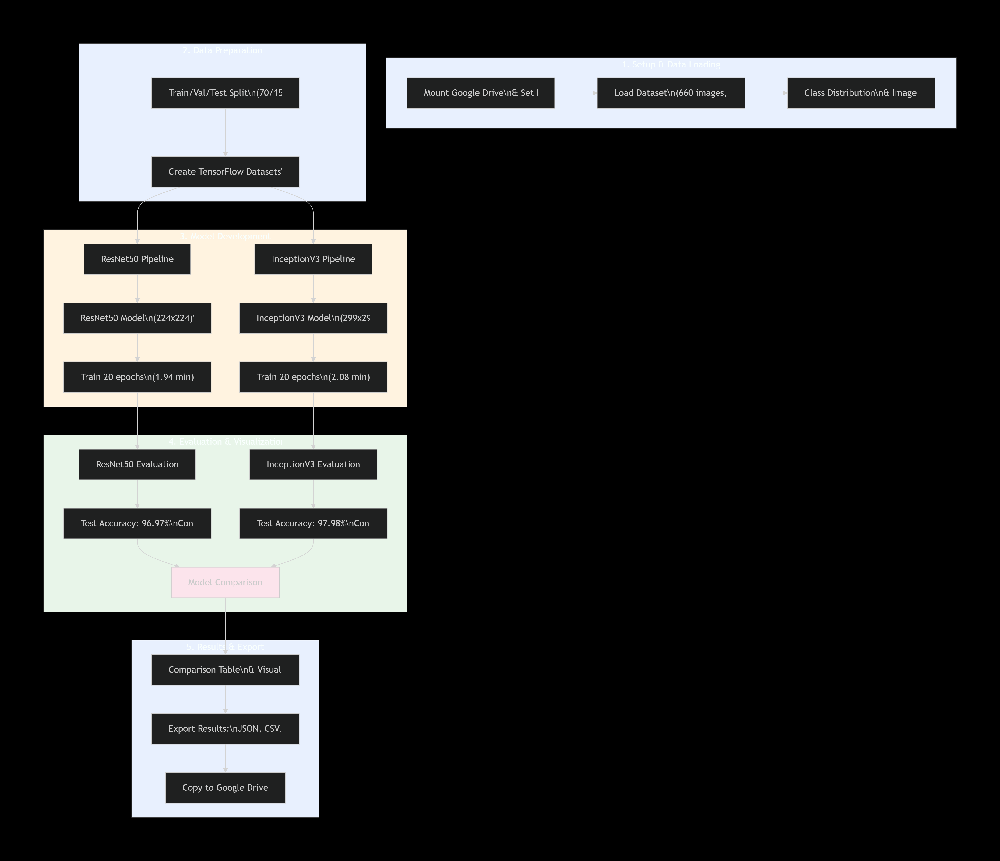

# Coin Classification using Transfer Learning

**Author:** Ali Hussain  
**Date:** November 2025  
**Environment:** Google Colab (Tesla T4, TensorFlow 2.19.0)

---

# Dataset Overview

- **Total Images:** 660
- **Classes:**
  - 1-pound
  - 10p
  - 20p
  - 2-pounds
  - 50p
  - 5p
- **Dataset Split:**
  - **Training:** 70% (462 images)
  - **Validation:** 15% (99 images)
  - **Test:** 15% (99 images)

---

# Project Pipeline

The following diagram illustrates the complete workflow of the coin classification project, from dataset preparation through preprocessing, transfer learning, model training, and evaluation.

  

---

# Methodology

## Preprocessing & Data Augmentation

### Image Resizing

- **ResNet50:** 224 × 224
- **InceptionV3:** 299 × 299

### Model-Specific Preprocessing

- **ResNet50:** Caffe preprocessing (mean subtraction)
- **InceptionV3:** Pixel scaling to **[-1, 1]**

### Data Augmentation

- Random horizontal flip
- Random brightness adjustment
- Random contrast adjustment